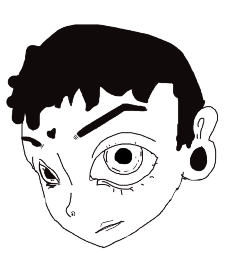

  Este proyecto es más que nada para que las personas que quieran aprender a dibujar, tengan los conocimientos basicos de dibujo, ya sea acuarelas o lapiz tambien agregue un estilos de tipos de dibujo. Para tener un controlo de las imagenes.

  

  Pero estodo esto con fines educativos y me sirve tanto a mi 
